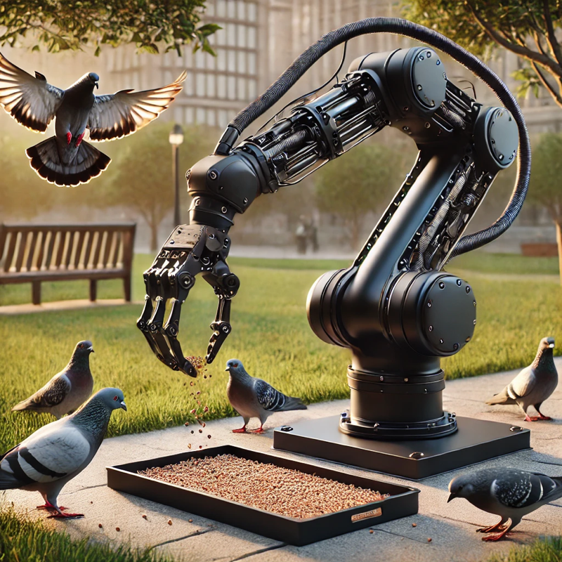

# Artwork name

|    |    |    |
|----|----|----|
| **year** | 2021 | 
| **Artist(s)** | Name of the artist | https://webartist.net |
| **Description** | *A long description of the artwork with the necessary detail (also technical details if necessary)*: Lorem ipsum dolor sit amet, consectetur adipiscing elit. Phasellus vehicula nisl nec magna vehicula, a dictum odio elementum. Proin tincidunt eros vel metus varius, eget gravida nunc porttitor. Curabitur non ultrices neque. Ut nec justo a nulla fermentum efficitur. Donec porttitor, tortor eget interdum tempor, velit eros convallis risus, sit amet facilisis est lectus id justo. Pellentesque habitant morbi tristique senectus et netus et malesuada fames ac turpis egestas. Integer at justo felis. | |
| **Conservation Satement** | *The conservation statement released by the artist(s), curator(s), conservator(s), ecc*: Lorem ipsum dolor sit amet, consectetur adipiscing elit. Phasellus vehicula nisl nec magna vehicula, a dictum odio elementum. Proin tincidunt eros vel metus varius, eget gravida nunc porttitor. Curabitur non ultrices neque. Ut nec justo a nulla fermentum efficitur. Donec porttitor, tortor eget interdum tempor, velit eros convallis risus, sit amet facilisis est lectus id justo. Pellentesque habitant morbi tristique senectus et netus et malesuada fames ac turpis egestas. Integer at justo felis.| |

## [Archive](archive) 

## Bibliography
Fiordelmondo A, Russo A, Pizzato M, Zecchinato L and Canazza S (2023) A multilevel dynamic model for documenting, reactivating and preserving interactive multimedia art. Front. Sig. Proc. 3:1183294. doi: 10.3389/frsip.2023.1183294

Fiordelmondo, A., & Canazza, S. (2023). Toward the Reactivation of the Time consumes—An Interview with Michele Sambin. Quarterly Review of Film and Video, 41(7), 916–931. https://doi.org/10.1080/10509208.2023.2173935

Alessandro Fiordelmondo, Sergio Canazza, and Niccoló Pretto. 2024. Reactivating and Preserving Interactive Multimedia Artworks: An Analog Performance from the Seventies. J. Comput. Cult. Herit. 17, 2, Article 27 (June 2024), 17 pages. https://doi.org/10.1145/3647995
